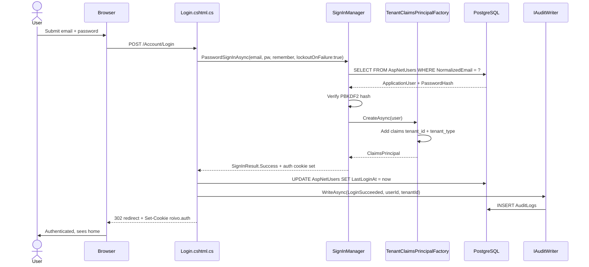
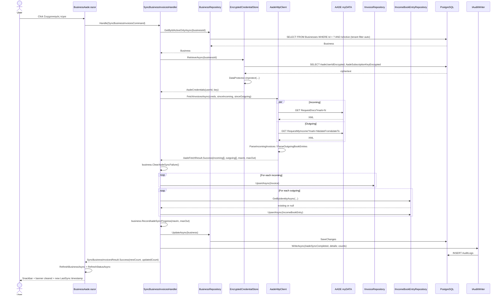
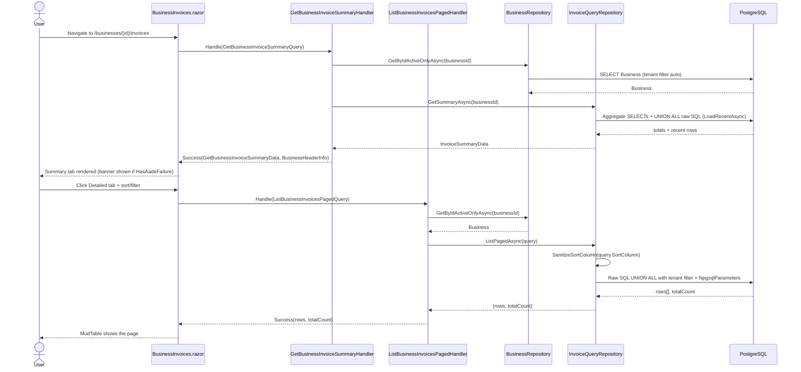

# End-to-End Flows

This document walks through real user actions step-by-step. Use this
alongside `docs/ARCHITECTURE.md` when debugging or modifying behavior.
Suggested breakpoints at the end of each flow help you trace data
movement in Visual Studio.

---

## Flow 1: User logs in

### Trigger

User opens `/Account/Login`, enters email + password, clicks **Σύνδεση**.

### Files involved (in order)

1. **`src/Roivo.Web/Areas/Account/Pages/Login.cshtml`** — the form. POSTs back to the same page.
2. **`src/Roivo.Web/Areas/Account/Pages/Login.cshtml.cs`** — `OnPostAsync(CancellationToken)`. Validates ModelState, calls `SignInManager.PasswordSignInAsync(email, password, rememberMe, lockoutOnFailure: true)`.
3. **ASP.NET Identity (`SignInManager` / `UserManager`)** — verifies password hash against `AspNetUsers`. Handles lockout state.
4. **`src/Roivo.Infrastructure/Identity/TenantClaimsPrincipalFactory.cs`** — on cookie creation, augments the principal with `tenant_id` + `tenant_type` claims read off the `ApplicationUser`.
5. **Cookie middleware** — issues the auth cookie. Cookie name is `roivo.auth` (configured via `AuthCookie:Name` in `appsettings.json`).
6. **`Login.cshtml.cs` (continued)** — on success: `_userManager.UpdateAsync(user)` to bump `LastLoginAt`, then `_audit.WriteAsync(AuditAction.LoginSucceeded, ...)`. On failure: writes `LoginFailed` / `LoginBlockedNotAllowed` / `AccountLockedOut` per branch.
7. **`src/Roivo.Infrastructure/MultiTenancy/HttpTenantContext.cs`** — *on the next request*, reads `tenant_id` + `tenant_type` claims so `ITenantContext` is populated for the rest of the session.
8. **Redirect** — `LocalRedirect(returnUrl ?? "/")`.

OpenIddict is **not** involved in interactive login — it's wired in for token issuance to API clients, not for the cookie-based browser session. See `src/Roivo.Web/Configuration/OpenIddictExtensions.cs`.

### Data flow

Form `Input.Email` + `Input.Password` → `SignInManager.PasswordSignInAsync` → Identity loads the user row, verifies the PBKDF2 hash, checks `LockoutEnabled` / `EmailConfirmed` (the app requires confirmed email — `appsettings.json` → `Identity:SignIn:RequireConfirmedEmail: true`) → returns `SignInResult`. On `Succeeded`, the auth cookie is written + claims are baked in via `TenantClaimsPrincipalFactory`. Page returns a redirect; the next request carries the cookie and `HttpTenantContext.CurrentTenantId` is non-empty.

### Sequence diagram

### Breakpoints to set in Visual Studio

1. **`Login.cshtml.cs` `OnPostAsync` first line.** Inspect: `Input.Email`, `Input.Password` (avoid copying the password anywhere — it's sensitive).
2. **`PasswordSignInAsync` call site.** Step over and watch `result.Succeeded` / `result.IsLockedOut` / `result.IsNotAllowed`.
3. **Inside `TenantClaimsPrincipalFactory.GenerateClaimsAsync` (or `CreateAsync`).** Confirm `tenant_id` + `tenant_type` claims are being added.
4. **The audit write** (success branch). Confirm `tenantId` + `userId` are populated.
5. **On the next request, `HttpTenantContext.CurrentTenantId` getter.** Inspect the claims principal — verify the claim was carried.

---

## Flow 2: User syncs AADE invoices

### Trigger

User is on `/businesses/{id}/aade` (a connected business) and clicks **Συγχρονισμός τώρα**.

### Files involved (in order)

1. **`src/Roivo.Web/Components/Pages/BusinessAade.razor`** — `HandleSyncNow()`. Sets `syncing = true`, calls `SyncHandler.Handle(new SyncBusinessInvoicesCommand(Id), CancellationToken.None)`, then switches on the result. On `Success` it calls `RefreshBusinessAsync()` + `RefreshStatusAsync()` so the local `business` reflects cleared failure state.
2. **`src/Roivo.Application/Features/Aade/Commands/SyncBusinessInvoices/SyncBusinessInvoicesCommand.cs`** — `sealed record SyncBusinessInvoicesCommand(Guid BusinessId)`.
3. **`src/Roivo.Application/Features/Aade/Commands/SyncBusinessInvoices/SyncBusinessInvoicesHandler.cs`** — the orchestrator.
4. **`src/Roivo.Infrastructure/Persistence/Repositories/BusinessRepository.cs`** — `GetByIdActiveOnlyAsync` issues `SELECT ... WHERE Id = ? AND IsActive` (tenant filter applied automatically by the global query filter).
5. **`src/Roivo.Aade/EncryptedCredentialStore.cs`** — `RetrieveAsync(businessId, ct)`: reads the ciphertext columns, decrypts via Data Protection, returns an `AadeCredentials(userId, subscriptionKey)` record.
6. **`src/Roivo.Aade/AadeHttpClient.cs`** — `FetchInvoicesAsync(userId, subscriptionKey, sinceIncomingMark, sinceOutgoingMark, ct)`. Issues **two parallel HTTP GETs**: `RequestDocs?mark=N` and `RequestMyIncome?mark=N&dateFrom=...&dateTo=...`. Polly retries 5xx + network errors; 4xx surfaces immediately.
7. **AADE myDATA API** (`https://mydataapidev.aade.gr` in dev) — returns XML.
8. **`AadeHttpClient.ParseIncomingInvoices` and `ParseOutgoingBookEntries`** — XML → DTO list. Wrapped into `AadeFetchResult.Success(incoming, outgoing, maxIncomingMark, maxOutgoingMark)`.
9. **Back in `SyncBusinessInvoicesHandler`** —
   - If `InvalidCredentials`: `business.RecordAadeSyncFailure("InvalidCredentials")` + save + return `SyncBusinessInvoicesResult.InvalidCredentials()`.
   - If `NetworkError` / `AadeServerError`: surface the variant unchanged — no failure-mark (transient).
   - If `Success`: `business.ClearAadeSyncFailure()`, then loop:
     - For each incoming DTO: `Invoice.Create(...)` → `_invoices.UpsertAsync(invoice, ct)`.
     - For each outgoing DTO: load-or-create `IncomeBookEntry` via `_bookEntries.GetByIdentityAsync(...)` → `UpdateTotals(...)` or `IncomeBookEntry.Create(...)` → `UpsertAsync`.
10. **`business.RecordAadeSyncProgress(maxIncomingMark, maxOutgoingMark)`** — advances marks (only-forward) + sets `LastAadeSyncAt = UtcNow`. Then `_businesses.UpdateAsync(business, ct)`.
11. **`src/Roivo.Application/Abstractions/IAuditWriter.cs`** implementation — writes `AuditAction.AadeSyncCompleted` with counts in `details`.
12. **Back in the page** — `RefreshBusinessAsync` re-reads the business so the `HasAadeFailure` banner reflects cleared state, `RefreshStatusAsync` re-reads connection status, snackbar shows new/updated counts.

### Data flow

Page sends `(BusinessId)` → handler loads `Business` from DB → loads credentials (decrypted in-memory only) → calls AADE with both saved marks as cursors → AADE returns XML for new docs since each mark → parser produces typed DTOs → handler upserts by natural key (`AadeMark` for invoices; `(BusinessId, CounterpartyAfm, IssueDate, DocumentTypeCode)` for book entries — see `IIncomeBookEntryRepository.GetByIdentityAsync`) → handler advances marks via domain method that refuses backward movement → save → audit. Page re-fetches `Business` so the banner and "last sync" timestamp reflect the new state without a hard refresh.

### Sequence diagram

Note on transactions: each repository method opens its own `DbContext` and saves internally (see `docs/CODING_STANDARDS.md` § DbContext lifecycle rule). The diagram's "SaveChanges" arrow is per-repository — there is **no** outer transaction wrapping the whole sync. If the process dies between Invoice upserts and the `Business.UpdateAsync`, the next run picks up at the saved marks (which weren't advanced), so already-upserted invoices are simply re-upserted by the same `AadeMark`. Idempotent.

### Breakpoints to set

1. **`BusinessAade.razor` `HandleSyncNow` first line.** Inspect: `Id`, `business?.HasAadeFailure`, `business?.LastAadeIncomingMark`.
2. **`SyncBusinessInvoicesHandler.Handle` first line.** Inspect: `command.BusinessId`, `_tenant.CurrentTenantId`.
3. **After `RetrieveAsync`.** Confirm `creds` is non-null and decryption worked. **Do not copy the values anywhere — they're real secrets.**
4. **`AadeHttpClient.FetchInvoicesAsync` first line.** Inspect: `sinceIncomingMark`, `sinceOutgoingMark`. First run: both `0`.
5. **After both `await` calls in `FetchInvoicesAsync` complete.** Inspect: HTTP status codes, body length.
6. **`ParseIncomingInvoices` return.** Inspect: `count`, sample DTO.
7. **In the handler, before each repository call.** Set conditional breakpoint on the first iteration to avoid stepping through 500 invoices.
8. **`business.RecordAadeSyncProgress` body** (`src/Roivo.Core/Domain/Entities/Business.cs`). Watch the "only forward" check.
9. **`AuditWriter.WriteAsync`.** Confirm `details` does not contain `userId` / `subscriptionKey` — only counts + business identifiers.
10. **Back in the page after `Handle` returns.** Inspect: result variant, `business` reference (should be the *stale* one until `RefreshBusinessAsync` runs).

---

## Flow 3: User views the cashflow page

### Trigger

User navigates to `/businesses/{id}/invoices`.

### Files involved (in order)

#### Initial load (summary tab)

1. **`src/Roivo.Web/Components/Pages/BusinessInvoices.razor`** — `OnInitializedAsync` calls `SummaryHandler.Handle(new GetBusinessInvoiceSummaryQuery(Id), CancellationToken.None)`.
2. **`src/Roivo.Application/Features/Invoices/Queries/GetBusinessInvoiceSummary/GetBusinessInvoiceSummaryHandler.cs`** — null-guard the query, load the `Business` via `_businesses.GetByIdActiveOnlyAsync`. Returns `BusinessNotFound` if missing.
3. **`src/Roivo.Application/Abstractions/IInvoiceQueryRepository.cs`** — `GetSummaryAsync(businessId, ct)` returns aggregate totals + `Recent` rows.
4. **`src/Roivo.Infrastructure/Persistence/Repositories/InvoiceQueryRepository.cs`** — `LoadRecentAsync` issues the raw-SQL `UNION ALL` over `Invoices` + `IncomeBookEntries`. **Tenant filter is hand-written** in the `WHERE` clause because EF Core's global query filter does not apply to raw SQL.
5. **Handler maps the result** into `GetBusinessInvoiceSummaryData` and a `BusinessHeaderInfo(Id, Name, Afm, HasAadeFailure, AadeLastFailureAt?, AadeLastFailureReason?)` — the failure fields drive the same warning banner that appears on `BusinessAade.razor`.
6. **Page renders** the summary tab. If `business.HasAadeFailure` is true, the banner shows above the tab strip.

#### Detailed tab (server-paginated table)

7. **`MudTable.ServerData`** fires whenever the user changes sort, page, or filter. Bound to `LoadServerData(TableState, CancellationToken)`.
8. **`src/Roivo.Web/Components/Pages/BusinessInvoices.razor`** — `LoadServerData` builds a `ListBusinessInvoicesPagedQuery` with current filter state (direction, date range, counterparty search, cancelled filter, sort).
9. **`src/Roivo.Application/Features/Invoices/Queries/ListBusinessInvoicesPaged/ListBusinessInvoicesPagedHandler.cs`** — null-guard, load business for tenant check, delegate to `_invoiceQueries.ListPagedAsync(query, ct)`.
10. **`InvoiceQueryRepository.ListPagedAsync`** — second raw-SQL `UNION ALL` query. Sort column passes through an allowlist (`SanitizeSortColumn`). All user input goes through `NpgsqlParameter`. Returns `(IReadOnlyList<InvoiceRow>, int TotalCount)`.
11. **Handler wraps result** as `ListBusinessInvoicesPagedResult.Success(rows, totalCount)`. The page hands MudTable a `TableData<InvoiceRow>` with the rows + total.

### Data flow

`/businesses/{id}/invoices` → page captures `Id` → summary handler returns `(totals + recent + business header with failure state)` → page renders the summary tab and the warning banner (if any). When the user switches to **Detailed**, MudTable calls `ServerData` per page/sort/filter; the page builds a `ListBusinessInvoicesPagedQuery` and the handler returns one page of rows + the total count from a parameterized raw-SQL query.

### Sequence diagram (initial summary load + first detailed-tab page)

### Breakpoints to set

1. **`BusinessInvoices.razor` `OnInitializedAsync`.** Inspect: `Id`.
2. **`GetBusinessInvoiceSummaryHandler.Handle` first line.** Confirm tenant context populated.
3. **After `_businesses.GetByIdActiveOnlyAsync`.** If null, the handler returns `BusinessNotFound` and the page navigates back to `/businesses` — useful failure-path check.
4. **`InvoiceQueryRepository.LoadRecentAsync` first line.** Inspect the SQL string; look for the explicit `"TenantId" = @tenantId` clause — this is the critical hand-rolled tenant filter.
5. **In the page, where the banner conditional renders.** Confirm `business.HasAadeFailure` is being read from the `BusinessHeaderInfo` DTO, not from a stale entity.
6. **`LoadServerData` first line.** Inspect: `state.Page`, `state.PageSize`, `state.SortLabel`, current filter fields.
7. **`InvoiceQueryRepository.ListPagedAsync`.** Inspect the SQL + parameters before `ExecuteAsync`. Verify the sort column came through `SanitizeSortColumn` and is one of the allowlist values.
8. **MudTable result construction** in the page. Inspect: `success.Rows.Count`, `success.TotalCount`.
