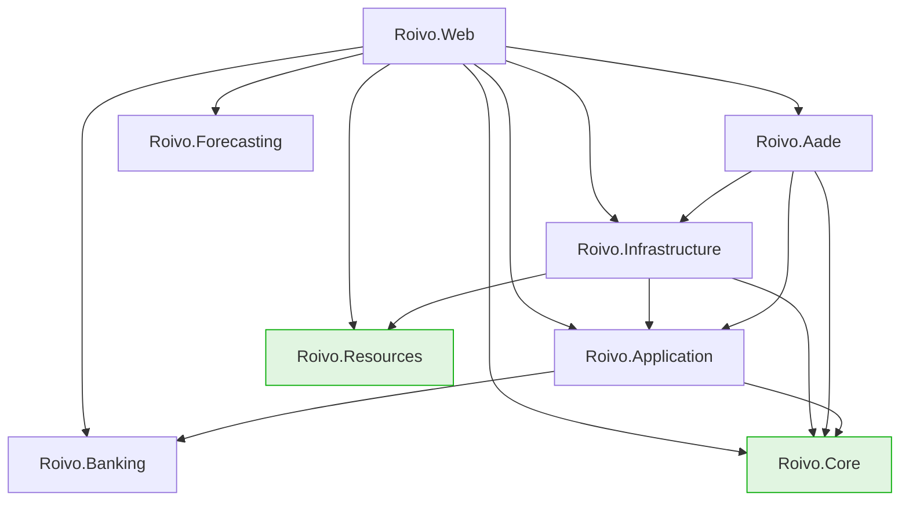
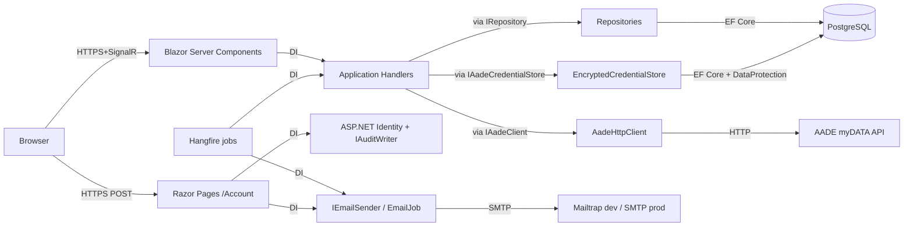
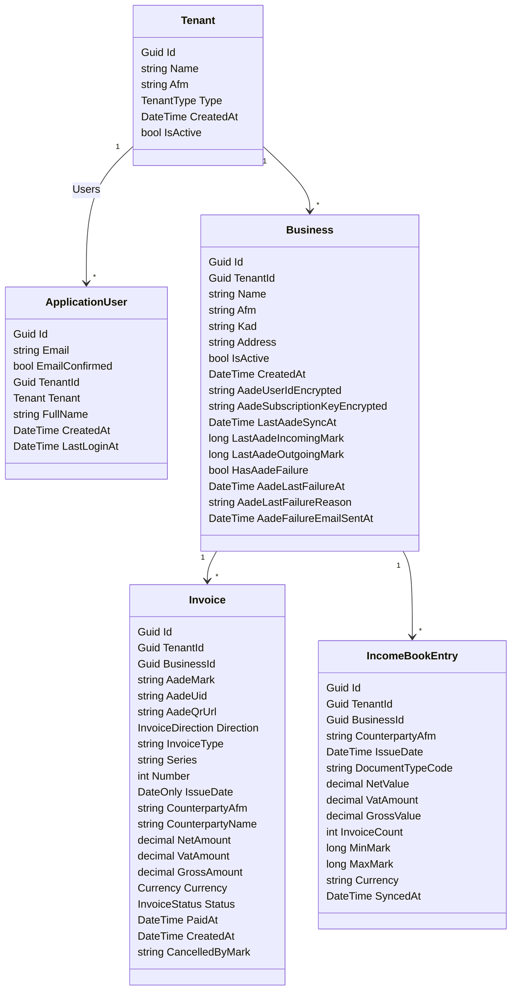

# Roivo Architecture

A complete map of the Roivo codebase. Read this before modifying any
significant code; debug through `docs/FLOWS.md` alongside this document.

## Project layout

```
src/
├── Roivo.Core/            Pure domain. Entities, enums, value objects, permission rules. No frameworks.
├── Roivo.Application/     CQRS handlers, abstractions (repository + service interfaces), result types.
├── Roivo.Infrastructure/  EF Core persistence, Identity claims factory, email (SMTP), background jobs that emit user-facing content.
├── Roivo.Aade/            AADE myDATA HTTP client, encrypted credential store, sync jobs (NightlyAadeSyncJob, SyncSingleBusinessJob).
├── Roivo.Banking/         Reserved for M5 PSD2 banking-aggregator integration. Currently minimal.
├── Roivo.Forecasting/     Reserved for M7 cashflow forecasting. Currently minimal.
├── Roivo.Resources/       Greek user-facing strings (Aade.cs, Auth.cs, Businesses.cs, Common.cs, Invoices.cs) + FormatExtensions.cs.
└── Roivo.Web/             Blazor Server + Razor Pages (Areas/Account for auth). DI composition root.

tests/
├── Roivo.Core.Tests/         Domain entity + permission tests.
├── Roivo.Application.Tests/  Handler tests using fakes (FakeBusinessRepository, FakeAadeClient, etc.).
├── Roivo.Infrastructure.Tests/  Notification-job tests (AadeFailureNotificationJobTests).
└── Roivo.Aade.Tests/         Placeholder.
```

## Project dependencies

The arrows below were verified against `<ProjectReference>` entries in every
`src/*/*.csproj` on 2026-05-29.



**Rule:** lower layers never reference higher layers. `Roivo.Core` is the
bottom; nothing depends on `Roivo.Web`. Adding an arrow from a green-shaded
node toward anything else would be a layering violation.

**Two real deviations from the rule worth knowing about:**

1. **`Roivo.Application → Roivo.Banking`.** Banking is a sibling infrastructure
   project (peer of Aade), and the original intent was for it to depend on
   Application — not the reverse. Currently inverted; revisit when M5 banking
   abstractions land. Until then, treat Banking as effectively part of
   Application's surface.
2. **`Roivo.Aade → Roivo.Infrastructure`.** Aade needs `IDataProtectionProvider`
   wiring to encrypt credentials, so it pulls in Infrastructure. Cleaner option
   would be a small DataProtection-only abstraction in Application, but the
   pragmatic shape works.

`docs/CODING_STANDARDS.md` § Layered architecture states
`Roivo.Aade → Roivo.Application + Roivo.Core` only. The Infrastructure edge
above is a known deviation; the standards doc has not yet been updated.

## Layered architecture

### Roivo.Core (`src/Roivo.Core/`)

**Purpose:** Pure domain. No frameworks, no I/O, no DI.

**Contains:** Entities with private setters + factory methods, enums,
permission rules (pure static functions), validators, domain exceptions.

**Forbidden:** EF Core, HttpClient, ILogger, MudBlazor, ASP.NET, any infrastructure.

**Example files:**
- `src/Roivo.Core/Domain/Entities/Business.cs` — aggregate root. `Business.Create(...)` is the factory; mutations like `Rename`, `ChangeAfm`, `Deactivate`, `RecordAadeSyncFailure` enforce invariants in one place.
- `src/Roivo.Core/Domain/Businesses/BusinessPermissions.cs` — pure static methods: `CanCreate`, `CanDeactivate`, `CanReactivate`, `CanEditAfm`, `CanManageAadeFor`. Take a `TenantType`, return `bool`. No I/O.
- `src/Roivo.Core/Domain/Auditing/AuditAction.cs` — enum with numeric ranges per domain (auth 0–99, businesses 100–199, AADE 200–299). The enum *name* is what ends up in the `AuditLogs.Action` column via `Enum.ToString()`, so values must never be reordered or renamed.

### Roivo.Application (`src/Roivo.Application/`)

**Purpose:** Use cases. Orchestrates domain + persistence + external systems.

**Contains:** Command/Query handlers organized vertically under `Features/<Aggregate>/...`, repository + service interfaces under `Abstractions/`, discriminated-union result records, the application-wide DI extension.

**Forbidden:** EF Core, ASP.NET, MudBlazor, Roivo.Resources (per the resource-layer rule).

**Example files:**
- `src/Roivo.Application/Features/Businesses/Commands/CreateBusiness/CreateBusinessHandler.cs` — canonical handler shape: null-guard → permission → load → validate → mutate → save → audit → return.
- `src/Roivo.Application/Abstractions/IBusinessRepository.cs` — persistence interface. Includes `ListWithExpiredAadeFailureAsync` + `GetTenantPrimaryEmailAsync` used by the notification job.
- `src/Roivo.Application/Configuration/ApplicationServiceCollectionExtensions.cs` — registers every handler in the project as scoped, plus shared services.

### Roivo.Infrastructure (`src/Roivo.Infrastructure/`)

**Purpose:** Concrete implementations of Application abstractions. EF Core lives here.

**Contains:** `ApplicationDbContext` + entity configurations, repository implementations, `HttpTenantContext` (reads tenant claims), `TenantClaimsPrincipalFactory` (injects claims), SMTP email, the AADE-failure notification job.

**Forbidden:** UI types (MudBlazor, Razor), HTTP clients to specific third parties (those live in dedicated infra projects like `Roivo.Aade`).

**Example files:**
- `src/Roivo.Infrastructure/Persistence/ApplicationDbContext.cs` — extends `IdentityDbContext<ApplicationUser, IdentityRole<Guid>, Guid>`. `ApplyTenantFilters` walks every `ITenantScoped` entity and installs `HasQueryFilter(e => e.TenantId == _tenantContext.CurrentTenantId)`.
- `src/Roivo.Infrastructure/Persistence/Repositories/InvoiceQueryRepository.cs` — raw-SQL `UNION ALL` over `Invoices` + `IncomeBookEntries`. `LoadRecentAsync` and `ListPagedAsync` are the two methods; tenant filtering is **manual** in the SQL (the global EF filter doesn't apply here).
- `src/Roivo.Infrastructure/Jobs/AadeFailureNotificationJob.cs` — runs daily at 09:00 Athens; sends 24h-failure email; this is *why* Infrastructure references `Roivo.Resources` (email body content).

### Roivo.Aade (`src/Roivo.Aade/`)

**Purpose:** AADE myDATA integration — the only place that knows AADE's HTTP wire format and XML quirks.

**Contains:** `AadeHttpClient` (typed HttpClient with Polly retry), `EncryptedCredentialStore` (ASP.NET Data Protection over the encrypted DB columns), `NightlyAadeSyncJob` + `SyncSingleBusinessJob`, `AadeServiceCollectionExtensions`.

**Forbidden:** `Roivo.Resources` (per layering rule — backend integrations don't translate UI strings). Note: also references `Roivo.Infrastructure` which the CODING_STANDARDS doc has not yet caught up with.

**Example files:**
- `src/Roivo.Aade/AadeHttpClient.cs` — `ValidateCredentialsAsync` (called from `ConnectAadeHandler`) and `FetchInvoicesAsync` (called from `SyncBusinessInvoicesHandler`). Both return result types from `Roivo.Application.Abstractions.Aade.Results` — no HTTP types leak across the boundary.
- `src/Roivo.Aade/EncryptedCredentialStore.cs` — implements `IAadeCredentialStore`. Class name does **not** match the convention "EncryptedAadeCredentialStore" the standards doc implies.
- `src/Roivo.Aade/Jobs/NightlyAadeSyncJob.cs` — fans out per-business work via `IBackgroundJobClient.Enqueue<SyncSingleBusinessJob>`.

### Roivo.Web (`src/Roivo.Web/`)

**Purpose:** Composition root + UI. Blazor Server for the authenticated app, Razor Pages for the Identity-driven Account area.

**Contains:** `Program.cs` (DI + middleware), `Components/Pages/*.razor` (Blazor pages), `Areas/Account/Pages/*.cshtml*` (login, register, reset, confirm), `Configuration/*Extensions.cs` (one `AddRoivoX` extension per concern).

**Forbidden per CODING_STANDARDS:** components inject *handlers*, never repositories or `DbContext`. No `SaveChangesAsync` calls from Razor.

**Example files:**
- `src/Roivo.Web/Program.cs` — chain of `AddRoivoX(...)` calls + middleware order + Hangfire recurring-job registrations.
- `src/Roivo.Web/Components/Pages/BusinessAade.razor` — connects/disconnects/syncs AADE for a business. Banner state derives from the loaded `Business` entity; `RefreshBusinessAsync()` keeps it fresh after each handler call.
- `src/Roivo.Web/Areas/Account/Pages/Login.cshtml.cs` — `OnPostAsync` calls `SignInManager.PasswordSignInAsync`, updates `LastLoginAt`, writes `AuditAction.LoginSucceeded`.

### Roivo.Resources (`src/Roivo.Resources/`)

**Purpose:** All user-facing Greek strings as `public const string`.

**Contains:** `Aade.cs`, `Auth.cs`, `Businesses.cs`, `Common.cs`, `Invoices.cs`, plus `FormatExtensions.cs` (the `.Format(arg)` helper).

**Forbidden:** Anything except const strings + a tiny formatting helper. Specifically not used by `Roivo.Application`, `Roivo.Core`, `Roivo.Aade`, `Roivo.Banking` (per CODING_STANDARDS). `Roivo.Infrastructure` was added recently because the notification job needs to render an email body.

**Example files:**
- `src/Roivo.Resources/Aade.cs` — connect/disconnect/sync UI labels, error messages per result variant, banner + email content for the 24h failure flow.
- `src/Roivo.Resources/Common.cs` — buttons, status words, nav labels.

## Key concepts

### Tenancy

Every business-level entity carries `TenantId`. `ITenantContext` (one
implementation, `HttpTenantContext`) returns the current tenant from claims.
EF Core query filters apply tenant scope automatically; raw SQL must apply
it manually.

**Where to look:**
- `src/Roivo.Application/Abstractions/ITenantContext.cs`
- `src/Roivo.Infrastructure/MultiTenancy/HttpTenantContext.cs` — reads `tenant_id` + `tenant_type` from claims
- `src/Roivo.Infrastructure/Persistence/ApplicationDbContext.cs` — `ApplyTenantFilters` installs `HasQueryFilter(e => e.TenantId == _tenantContext.CurrentTenantId)` on every `ITenantScoped` entity
- `src/Roivo.Infrastructure/Persistence/Repositories/InvoiceQueryRepository.cs` — raw-SQL example; tenant filter is hand-written in the `WHERE` clause

### Tenant types and permissions

Two tenant types: `Accountant = 1` and `Business = 2`. Permission rules live
in `BusinessPermissions` — a pure static class in `Roivo.Core`. Handlers
check permissions before loading entities; UI components call the same
methods to decide which controls to render.

**Where to look:**
- `src/Roivo.Core/Domain/Enums/TenantType.cs`
- `src/Roivo.Core/Domain/Businesses/BusinessPermissions.cs` — `CanCreate`, `CanDeactivate`, `CanReactivate`, `CanEditAfm`, `CanManageAadeFor`
- `src/Roivo.Application/Features/Businesses/Commands/UpdateBusiness/UpdateBusinessHandler.cs` — example handler that calls `BusinessPermissions` first

### Command/Query handlers

CQRS without MediatR. Each handler is a `sealed class` registered in DI
under `ApplicationServiceCollectionExtensions`. Pages inject handlers
directly and call `Handle(command, ct)`. No reflection-based dispatch.

**Where to look:**
- `src/Roivo.Application/Configuration/ApplicationServiceCollectionExtensions.cs`
- `src/Roivo.Application/Features/Businesses/Commands/CreateBusiness/CreateBusinessHandler.cs`

### Result types (discriminated unions)

Handlers return abstract records with `sealed record` variants. Callers
pattern-match. `Success` carries returned data; failure variants carry the
information needed to render a useful message.

**Where to look:**
- `src/Roivo.Application/Features/Businesses/Commands/CreateBusiness/CreateBusinessResult.cs` — variants: `Success(Guid)`, `Forbidden(string Reason)`, `InvalidAfm`, `ActiveDuplicate(string Afm)`, `InactiveDuplicate(Guid ExistingId, string OldName, string? OldAddress)`
- `src/Roivo.Application/Abstractions/Aade/Results/AadeFetchResult.cs` — `Success`, `InvalidCredentials`, `NetworkError`, `AadeServerError`

### Validation order in handlers

Standard order, applied uniformly: null-guard → permission → load → existence
→ business-rule validation → mutate → save → audit → return.

**Where to look:**
- `docs/CODING_STANDARDS.md` § Handler structure
- `src/Roivo.Application/Features/Businesses/Commands/DeactivateBusiness/DeactivateBusinessHandler.cs`

### Encrypted credential storage

AADE credentials live in `Businesses.AadeUserIdEncrypted` /
`AadeSubscriptionKeyEncrypted` as ciphertext. The ASP.NET Data Protection
API does the encryption; the key ring is scoped per tenant via the purpose
parameter. `IAadeCredentialStore` is the abstraction;
`EncryptedCredentialStore` (in `Roivo.Aade`) is the only implementation.

**Where to look:**
- `src/Roivo.Application/Abstractions/Aade/IAadeCredentialStore.cs`
- `src/Roivo.Aade/EncryptedCredentialStore.cs`

### Audit logging

`AuditAction` enum (auth 0–99, businesses 100–199, AADE 200–299). Audit
writes always happen **after** the action succeeds; a failed save produces
no audit entry. Audit row failures must never bubble up as a 500 — they're
swallowed + logged.

**Where to look:**
- `src/Roivo.Core/Domain/Auditing/AuditAction.cs`
- `src/Roivo.Application/Abstractions/IAuditWriter.cs` — `WriteAsync(action, userId?, tenantId?, entityType?, entityId?, details?, ct)`

### Hangfire jobs

Two recurring jobs registered in `Program.cs`:

| Recurring ID | Cron | Class |
|---|---|---|
| `nightly-aade-sync` | 03:00 Europe/Athens daily | `Roivo.Aade.Jobs.NightlyAadeSyncJob` |
| `aade-failure-notification` | 09:00 Europe/Athens daily | `Roivo.Infrastructure.Jobs.AadeFailureNotificationJob` |

Per-business work (`SyncSingleBusinessJob`) is enqueued fanout-style by the
nightly job. The dashboard mounts at `/hangfire` in development only.

**Where to look:**
- `src/Roivo.Web/Program.cs` — `RecurringJob.AddOrUpdate<...>` calls at the bottom
- `src/Roivo.Aade/Jobs/NightlyAadeSyncJob.cs` and `SyncSingleBusinessJob.cs`
- `src/Roivo.Infrastructure/Jobs/AadeFailureNotificationJob.cs`

### Resilience

Polly retry on transient HTTP failures inside `AadeHttpClient` (configured
in `AadeServiceCollectionExtensions.GetRetryPolicy`). Result types carry the
failure category. The `Business` entity tracks `HasAadeFailure` /
`AadeLastFailureAt` / `AadeLastFailureReason` / `AadeFailureEmailSentAt` so
sustained auth failures surface as a banner + a 24-hour email.

**Where to look:**
- `docs/RESILIENCE_PATTERNS.md`
- `src/Roivo.Aade/AadeHttpClient.cs`
- `src/Roivo.Aade/Configuration/AadeServiceCollectionExtensions.cs` — `GetRetryPolicy`

## Component diagram



## Entity model

Verified against `src/Roivo.Core/Domain/Entities/` on 2026-05-29. EF
configuration extras (column types, indexes, default values) live in
`src/Roivo.Infrastructure/Persistence/Configurations/`.



Notes:
- `ApplicationUser` is `IdentityUser<Guid>`; only the Roivo-added members are shown. Nullables (`Tenant?`, `LastLoginAt?`) and read-only setters are stripped from the class diagram for Mermaid compatibility — see the entity .cs files for the precise C# signatures.
- `Invoice.AadeMark` is a `string`, not a `long`. (Mark is treated as opaque in the entity; the *advancement check* on `Business.LastAadeIncomingMark` is numeric.)
- `IncomeBookEntry` has no FK navigation property to `Business`; it's keyed by the `(BusinessId, CounterpartyAfm, IssueDate, DocumentTypeCode)` tuple in the repository.

## Where to add new things

| New thing | Where it goes |
|---|---|
| Entity | `src/Roivo.Core/Domain/Entities/` |
| Domain enum | `src/Roivo.Core/Domain/Enums/` |
| Permission rule | `src/Roivo.Core/Domain/<Aggregate>/<Aggregate>Permissions.cs` |
| Handler | `src/Roivo.Application/Features/<Aggregate>/Commands\|Queries/<ActionName>/` |
| Abstraction (interface) | `src/Roivo.Application/Abstractions/` |
| Repository implementation | `src/Roivo.Infrastructure/Persistence/Repositories/` |
| EF entity configuration | `src/Roivo.Infrastructure/Persistence/Configurations/` |
| Background job that emails users | `src/Roivo.Infrastructure/Jobs/` (Resources is reachable) |
| Background job that orchestrates handlers | `src/Roivo.Aade/Jobs/` (or a sibling infra project) |
| Page (authenticated) | `src/Roivo.Web/Components/Pages/` |
| Page (Identity flow) | `src/Roivo.Web/Areas/Account/Pages/` |
| Greek string | `src/Roivo.Resources/<Domain>.cs` |
| Migration | `dotnet ef migrations add <Name> -p src/Roivo.Infrastructure -s src/Roivo.Web` |
| Test | `tests/Roivo.<Project>.Tests/` matching the source project |
